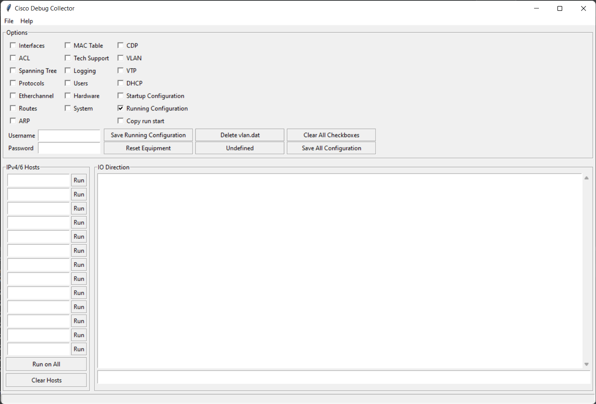

# Ditzel's Cisco Assistant - WIP
A desktop app that lets you collect information about Cisco devices by means of ´show´ commands.

SSH connections are programmed to run sequentially and inject commands. Output is saved in text files and after all connections have finished Jinja2 is used to render the textfiles into webpages that are interlinked for easy navigation between devices.

## Preview
 
## License
Undecided